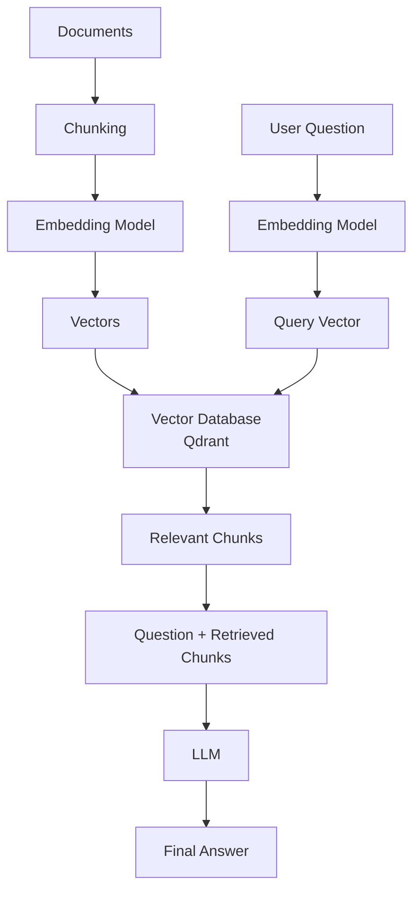
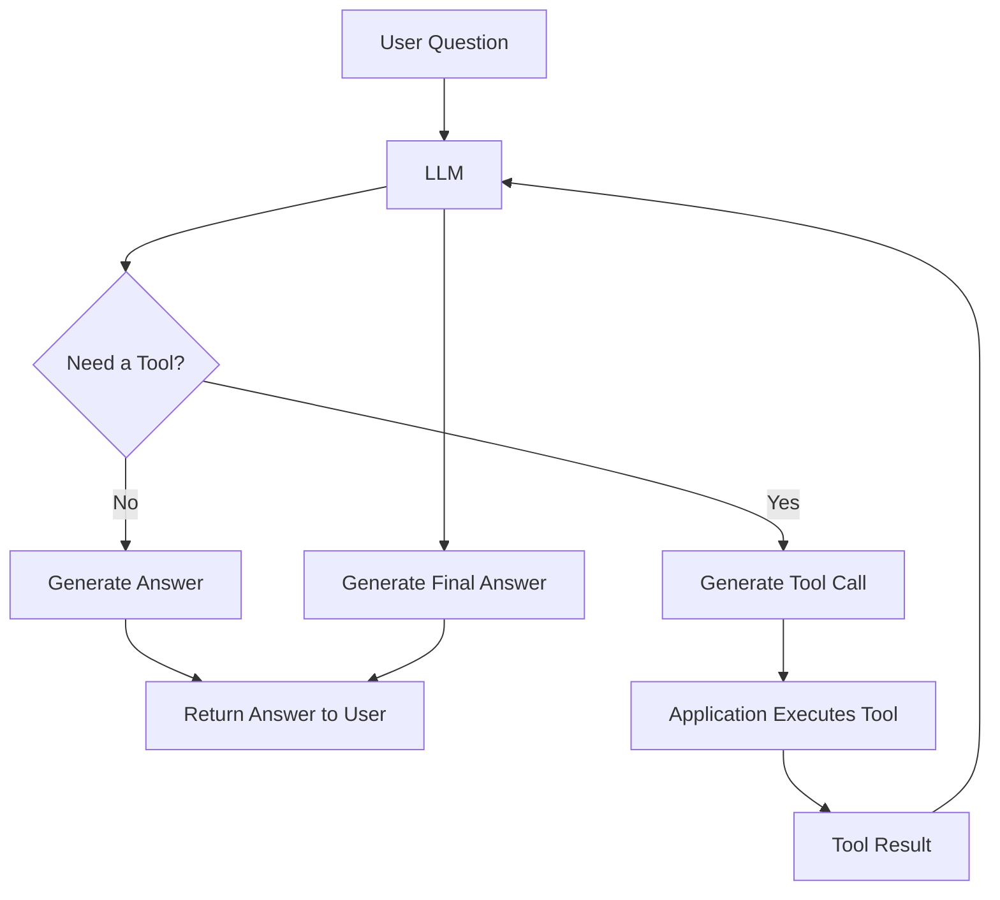
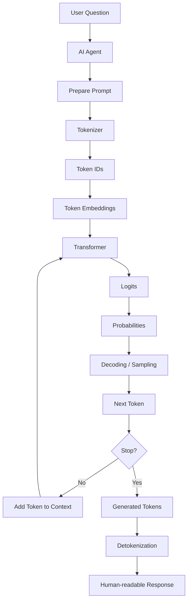
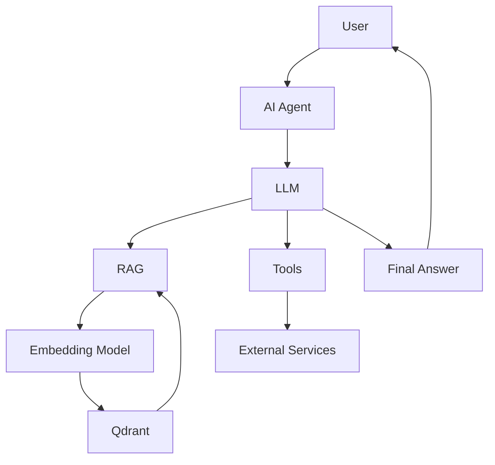
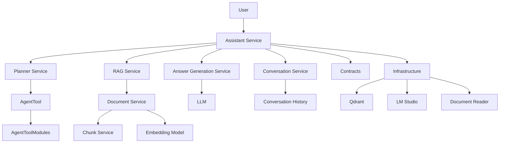

# AI Agent With .Net 

## Table of Contents
* [About the repo](#about-the-repo)
* [Some important concepts](#some-important-concepts)
  * [What is an AI Agent?](#what-is-an-ai-agent)
  * [What is LLM?](#what-is-llm)
  * [Embedding Model](#embedding-model)
  * [Vector Database](#vector-database)
  * [RAG](#rag)
  * [Chunking](#chunking)
  * [How do Embedding, Vector Databses and Chunking, work together in a RAG system?](#how-do-embedding-vector-databses-and-chunking-work-together-in-a-rag-system)
  * [LLM Tool Calling](#llm-tool-calling)
  * [What is a Token in the AI/LLM World?](#what-is-a-token-in-the-aillm-world)
* [Project Overview](#project-overview)
* [Architecture And Structure](#architecture-and-structure)
* [Infrastructure & Requirements](#Infrastructure-Requirements)
  * [Basic Setup](#Basic-setup)

## About The Repo
As AI agents are an important part of software development, I have decided to run a simple project and develop an AI agent. 
Since I'm a .NET developer, I have decided to develop the project with .NET. So, this project is good for .NET developers who are not familiar with AI agents. 
Understanding this project can help them learn about it.

Also, I had an idea which can be a potential idea in the AI agent industry. Actually, I wanted to build an AI agent which is pluggable, 
where every developer can fetch the project, just write their tool, and add it to the project, without doing anything more. The agent runs and can call the tool.

## Some Important Concepts
I want to explain some important concepts in the AI agents world, then start coding. 
If you are a bit familiar with AI agents, you have probably heard about them. Understanding these concepts helps you design and develop AI agents more easily and better.

### What is an AI Agent?
**AI Agent** is a system built around an LLM that can understand a user's goal, decide what actions are needed, use available tools or knowledge, and produce a final result.

### What is LLM?
**LLM** (Large Language Model) is a **neural-network-based** model **trained** on a large amount of **text** to understand and generate **human language**. 
In our project, the LLM is responsible for understanding the user's question and generating the final response.

### Embedding Model
An embedding model converts **text** into a **vector**, which is a collection of **numerical** values. 
The values are not necessarily limited to a specific range and can also be negative.
Forexample this is a vector of a text: [0.12, -0.43, 0.87, ...]

An **embedding model** is trained to create **numerical representations** of the **semantic characteristics** of text. 
During **training**, the model learns **relationships** between **words**, **phrases**, and their surrounding **context** from a **large amount of text**.

When we give a piece of text to an **embedding model**, it generates a vector that **represents** the **meaning** and **characteristics** of that **text**. 
**Texts** with **similar meanings** tend to produce **vectors** that are **closer** to each other in the vector space.

### Vector Database
A **Vector Database** is a type of database designed to store and efficiently **search vectors** based on their **similarity**.

Typically, a vector is stored together with a payload containing information related to that vector, such as the original text, document name, or page number.

When we want to search for relevant information, we first convert our target text into a vector using an embedding model. 
We then send this vector to the Vector Database.

The Vector Database compares the query vector with the stored vectors and finds the vectors that are most similar to it. 
It then returns the matching vectors together with their associated payloads.

### RAG
RAG stands for Retrieval-Augmented Generation. **RAG** is a technique that allows an AI agent to use **external knowledge without retraining** or modifying its LLM.

Every AI agent typically uses an LLM that has already been trained and has knowledge learned during its training. 
However, the LLM doesn't automatically have access to our private documents or other external knowledge.

RAG helps us build a system that stores our documents and, whenever we need to ask something about them, retrieves the appropriate parts of the documents. 
These retrieved parts are then added to the context that we send to the LLM. The LLM can then generate an answer based on the retrieved information together with the knowledge it already has.

### Chunking
Why do we need to chunk documents in RAG systems? In a typical RAG system, we first divide the document into smaller chunks, 
then create an embedding for each chunk and store the vectors in a vector database.

The goal is not to make the chunks as small as possible. Instead, we want each chunk to be small enough to allow precise semantic search 
while still containing enough context to represent a meaningful piece of information.

Imagine you have a 20-page PDF document and only one page defines the company's days-off policy. 
If you save the entire PDF as a single piece, when the user asks about the days-off policy, 
the retrieval system may return the entire document. The LLM would then receive much more information than it needs.

However, if you chunk the PDF into 20 meaningful pieces, the retrieval system can find the chunk containing the days-off policy 
and send only that relevant information to the LLM. This can reduce the number of tokens sent to the LLM, reduce costs, and potentially make the answer faster and more focused.

### How do Embedding, Vector Databses and Chunking, work together in a RAG system?
First, we give some documents to the system. The system chunks the documents into smaller pieces.

Second, it sends each chunk to the embedding model, which generates a vector for each chunk.

Third, the system stores these vectors in a vector database such as Qdrant, usually together with their corresponding chunks and metadata.

Fourth, when a question arrives, the system sends the question to the embedding model and gets a vector representing the question. 
It then sends this vector to the vector database, which searches for vectors that are semantically similar to the question and returns the corresponding relevant chunks.

Finally, the system gives the original question together with the retrieved chunks to the LLM. The LLM uses the retrieved information, together with its pretrained knowledge, to generate the response.

### LLM Tool Calling
In a simple AI agent, the user sends a question to the agent, and the LLM generates an answer based on its pretrained knowledge. 
However, there are situations where the LLM cannot directly perform an operation or access the required information.

For example, if the user asks about tomorrow's weather, the LLM cannot know the actual forecast from its pretrained knowledge. It needs to call an external weather service.

For these situations, we can provide the agent with tools. A **tool** is a **function** or **service** that the **agent** can call **to perform** a specific **task** or **access external information**. 
For example, we can create tools for weather information, mathematical calculations, database queries, or calling external APIs.

When the agent receives a question, the LLM is given the available tools and their descriptions. 
The LLM determines whether it can answer the question using its own knowledge or whether it needs to call one of the available tools.

If a tool is needed, the LLM generates a tool call with the required parameters. The agent executes the tool and receives its result. 
The result is then provided back to the LLM, which uses it to generate the final answer.

If no tool is needed, the LLM can answer directly.

### What is a Token in the AI/LLM World?
When a user asks a question, an AI agent prepares a prompt and sends it to an LLM. An LLM is a neural network based on the Transformer architecture, 
and the neural network operates on numerical representations rather than directly processing human-readable text.

Before the text can be processed by the LLM, it is converted into smaller pieces called **tokens**. 
This process is called **tokenization**. Tokens are not necessarily complete words. A word can sometimes be represented by multiple tokens. For example, the word `unbelievable` might be split into `un`, `believ`, and `able`.

A tokenizer has a vocabulary that maps tokens to token IDs. After tokenization, the text is represented as an array of token IDs and passed to the model. 
The model then converts these token IDs into internal numerical representations called **token embeddings**.

The core of an LLM is its neural network. Modern LLMs commonly use the **Transformer architecture**, 
which consists of many layers that transform the numerical representations of the tokens and model the relationships between them. 
During training, the model processes a huge amount of text and adjusts its parameters so it can recognize and reproduce patterns in how people use language.

When generating an answer, the LLM does not produce the entire answer at once. Instead, it generates the response **one token at a time**. 
For each step, the model processes the current context and produces scores for possible next tokens. These scores are converted into probabilities, 
and a decoding strategy selects the next token. The selected token is then added to the context, and the process repeats until the model decides to stop.

## Project Overview
**Personal AI Assistant** is a local AI agent built with **.NET** that can answer user questions based on the LLM's knowledge or use documents uploaded to the system to provide more relevant answers.

The project also provides several **tools** that allow the AI assistant to access external services.
For example, it can fetch weather forecasts or query a specific database through SQL Server. More tools can be added to the project to extend the assistant's capabilities.

This project combines **RAG, embeddings, vector search, LLM tool calling, and a local LLM** to provide an AI assistant that can retrieve 
relevant information from uploaded documents and call tools when a task requires external data or an operation that the LLM cannot perform by itself.

The main goal of this project is to **learn how to build and run an AI agent and understand the fundamental concepts of the AI-agent world**, 
such as **LLMs, embeddings, chunking, vector search, RAG, and tool calling**.

## Architecture and Structure

This is a **monolithic but pluggable** project. The core or brain of the project is called **Engine**. This is where the main services of the AI assistant are implemented. These services provide the main capabilities of our AI assistant.

The **Engine** contains the following services:

* **RAG Service**: enables the AI assistant to retrieve relevant information from uploaded documents and answer questions based on them.
* **Answer Generation Service**: generates the final answer using the available context and the LLM.
* **Conversation Service**: manages the user's previous messages and the current conversation context.
* **Document Service**: receives documents, processes them, converts their chunks into vectors using the embedding model, and stores them in Qdrant.
* **Chunk Service**: breaks large documents into smaller chunks before they are embedded and stored.
* **Planner Service**: determines whether a tool is needed and handles scenarios where multiple tools need to be called.
* **Assistant Service**: acts as the main orchestrator and coordinates the other services according to the user's request.

Besides the **Engine**, the project contains the following components:

* **Contracts**: contains shared data models and interfaces used between different parts of the system.
* **Infrastructure**: contains implementations of the external technologies and infrastructure required by the AI assistant, such as the LLM provider and vector database.
* **AgentTool**: provides the foundation for making the project pluggable by defining the base abstractions required to add new tools.
* **AgentToolModules**: contains the actual tool implementations that can be added to the AI assistant.

## Infrastructure & Requirements

This project does not require a specific LLM or high-end hardware. Since it is a learning project, you can choose a local LLM based on your system's hardware capabilities.

For running the LLM locally, this project uses **LM Studio**. LM Studio allows you to download and run different LLMs locally and exposes an API that the application can use to communicate with the model.

In this project, I used `phi-3-mini-4k-instruct` as the LLM based on my system configuration. You can replace it with another model that is more suitable for your hardware.

The project also requires an **embedding model** to convert text into vectors. I used `text-embedding-nomic-embed-text` through LM Studio.

For storing and searching the generated vectors, the project uses **Qdrant**, which is a vector database. Qdrant is run locally using Docker.

### Basic Setup

1. Download and install **LM Studio**.
2. Find and download an LLM that is suitable for your system.
3. Load and run the LLM in LM Studio.
4. Download and run `text-embedding-nomic-embed-text` as the embedding model.
5. Start LM Studio's local API server and verify that the API endpoint is accessible.
6. Install **Docker** if it is not already installed.
7. Run **Qdrant** using Docker.
8. Open the Qdrant dashboard in your browser and verify that the database is running.

